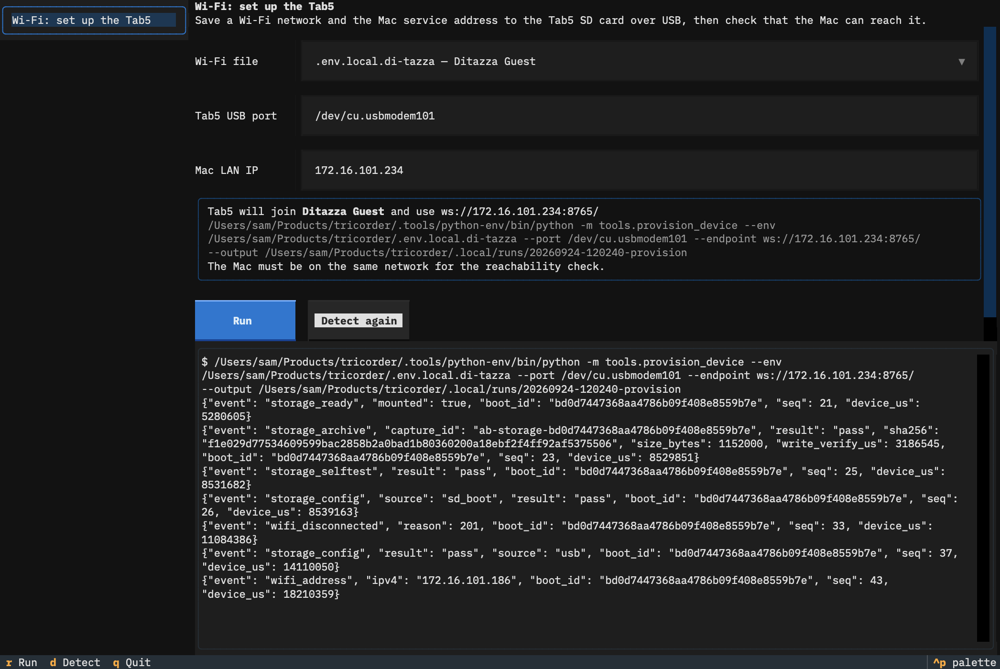

# Tricorder

A handheld, agent-assisted instrument for exploring the physical world with the M5Stack Tab5 (ESP32-P4).

Hold it, point it, move it, and ask questions. The goal is to learn what the device can do while a person and an agent investigate something together in real time. Co-developed with OpenAI Codex and Claude Code.

## Start here

- [Vision](vision.md): the product concept.
- [Milestones](planning/milestones.md): current state and next work, via Milestone → Goal → Spec, plus [ADRs](planning/adrs/).
- [Planning guidelines](planning/README.md): how the docs are kept.
- [Guided A/B protocol](planning/guided-ab-protocol.md): states and wire protocol. [Guided A/B operations](planning/guided-ab-operations.md): trial, provisioning and replay commands.
- [TODO](TODO.md): tasks that need the operator.

## Layout

| Path | Contents |
| --- | --- |
| `firmware/` | ESP-IDF 5.4.2 app (`main/`): diagnostics, media owner, Guided A/B client, SD, Wi-Fi |
| `tools/` | Mac-side Python: serial collector, investigation service, provisioning, evidence assessors |
| `tests/` | Host tests (Python + native C++ under ASan) |
| `planning/` | Milestones, goals/specs, ADRs, fixtures |
| `.tools/`, `.local/` | Ignored: toolchains, private runs, captures, backups |

## Development

Requires Git, `uv` and Python 3.

```sh
python3 tools/bootstrap.py                     # pinned vendor sources + ESP32-P4 toolchain
tools/idf.sh -C firmware build
tools/idf.sh -C firmware -p PORT flash         # confirm the board's USB identity first
python3 -m venv .tools/investigation-env
.tools/investigation-env/bin/python -m pip install -r tools/investigation-requirements.txt -r tools/openai-requirements.txt
.tools/investigation-env/bin/python -m pip install -r tools/stt-requirements.txt   # local speech-to-text (Apple Silicon)
.tools/investigation-env/bin/python -m pip install -r tools/tts-requirements.txt   # local spoken guidance (Pocket TTS)
.tools/investigation-env/bin/python -m unittest discover -s tests -q
```

Bench operations TUI (needs only `uv`; tasks are in `tools/ops_tasks.py`). It currently sets up the Tab5's Wi-Fi and Mac service address and checks the Mac can reach it:

```sh
uv run tools/ops.py
```




Serial capture of a diagnostic run (see `--help` for `--checks`, `--stop-file`, `--spec-id`):

```sh
.tools/python-env/bin/python -m tools.capture_serial --port PORT --output .local/runs/NEW --seconds 360 --reset
```

Evidence assessors (`python3 -m tools.<name> RUN_DIR`): `camera_baseline_evidence`, `audio_baseline_evidence`, `imu_baseline_evidence`, `ui_baseline_evidence`, `jpeg_evidence`, `preview_evidence`, `restart_evidence`, `device_spectrum`, `investigation_evidence`. `tools.inspect_capture` converts a capture to PNG/WAV.

## Device notes

- The Tab5's USB serial is **E8:F6:0A:E2:E0:0E**. Rediscover the port with `.tools/python-env/bin/python -m serial.tools.list_ports -v`; another attached board may show up too.
- **Opening the serial port can reset the Tab5.** Keep one collector open for a whole trial, and prefix long runs with `/usr/bin/caffeinate -is` (Mac sleep drops USB data).
- Wi-Fi and the service endpoint load from SD at boot. Provision them with `tools.provision_device` ([operations doc](planning/guided-ab-operations.md#sd-provisioning-archive-and-download)). The SD card holds plaintext Wi-Fi credentials, so keep it private. Currently provisioned (2026-09-24) for Newnet (`.env.local.newnet`, endpoint 192.168.0.44).
- The private `firmware/sdkconfig` sets `CONFIG_TRICORDER_GUIDED_AB_STARTUP=y` (boot straight to Guided A/B, skipping diagnostics).
- Flash backups and recovery steps: `.local/runs/20260920-baseline/RECOVERY.md`.
- Secrets live in ignored `.env.local.*` files. Never print or commit them.
- Guest/café Wi-Fi usually blocks client-to-client traffic (the device can't reach the Mac). Use a phone hotspot on 2.4 GHz (iPhone: Maximize Compatibility) for both, and copy the SSID exactly (iPhone names use a curly ’).

## Live text provider

Put `OPENROUTER_API_KEY` in the ignored `.env.local.openrouter` (parsed literally, never sourced), then:

```sh
.tools/investigation-env/bin/python -m tools.investigation_service --host MAC_LAN_IP --port 8765 \
  --output .local/runs/NEW --provider openrouter --model openai/gpt-5.6-sol --env .env.local.openrouter
```

Only verified measurement summaries, fixture notes and the operator's confirmed question go to the provider. Raw recordings stay local.

The service transcribes spoken questions locally with Parakeet (`--stt parakeet`, the default; loads in about 5 s at start). `--stt none` turns spoken questions off. Guidance is spoken with Pocket TTS, voice "alba" (`--tts pocket`, the default); `--tts say` uses macOS speech, `--tts none` turns it off.

## License

[MIT](LICENSE)
